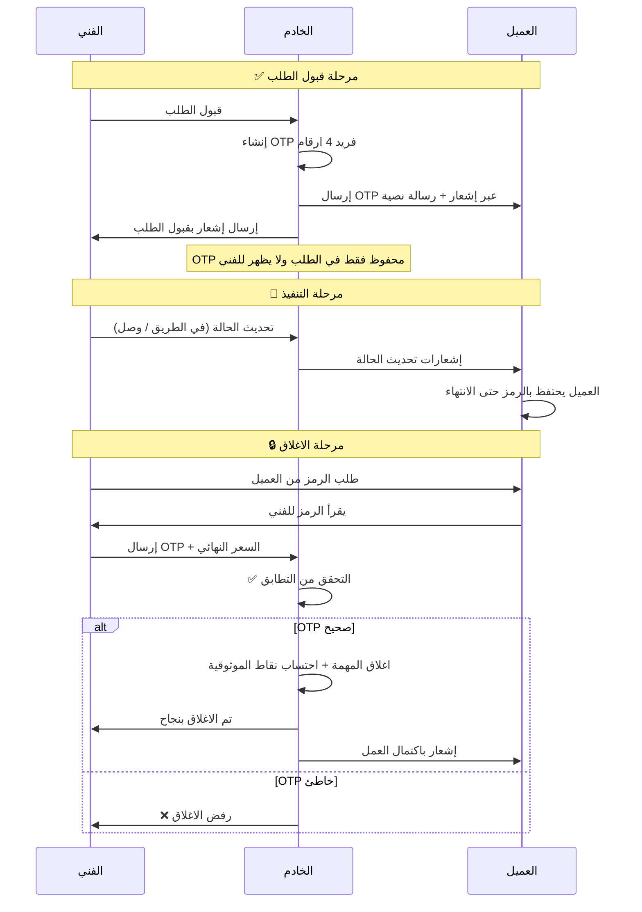
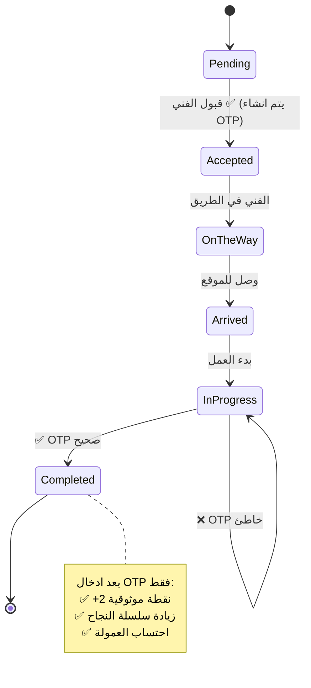

# 📑 وثائق نظام OTP الكامل - TechnoHome
## ✅ المستوى: وثائق فنية احترافية للمناقشات و العروض

---

## 🎯 نظرة عامة على النظام
نظام OTP ليس مجرد رمز تحقق، بل هو **نظام إدارة الثقة الموزع** الذي يمثل النقطة المركزية في كامل سير العمل بالمنصة.

---

## 📌 مخططات UML للنظام

### 🔹 1. مخطط التسلسل (Sequence Diagram)


---

### 🔹 2. مخطط الحالات (State Machine Diagram)


---

### 🔹 3. مخطط الاستخدام (Use Case Diagram)
```mermaid
usecaseDiagram
    actor الفني
    actor العميل
    actor النظام

    usecase UC1: قبول الطلب
    usecase UC2: انشاء OTP
    usecase UC3: ارسال OTP للعميل
    usecase UC4: طلب الرمز عند الانتهاء
    usecase UC5: ادخال OTP للاغلاق
    usecase UC6: التحقق من صحة OTP
    usecase UC7: اغلاق المهمة بنجاح
    usecase UC8: حظر الفني في حال المهام المعلقة

    الفني --> UC1
    الفني --> UC4
    الفني --> UC5
    العميل --> UC3
    النظام --> UC2
    النظام --> UC6
    النظام --> UC7
    النظام --> UC8
```

---

## 🎯 جميع حالات الاستخدام (Use Cases)

| الرقم | الحالة | الوصف | الشروط | النتيجة |
|---|---|---|---|---|
| UC1 | إنشاء OTP | يتم انشاء رمز فريد فور قبول الفني للطلب | عند الانتقال لحالة Accepted | OTP 4 ارقام + ارسال تلقائي للعميل |
| UC2 | حظر قبول طلبات جديدة | منع الفني من قبول طلبات اذا كان لديه مهمة معلقة اكثر من 24 ساعة | اذا وجدت مهمة لم تغلق بالـ OTP منذ اكثر من يوم | ❌ رفض قبول اي طلب جديد |
| UC3 | التحقق من OTP عند الاغلاق | التحقق من تطابق الرمز المرسل مع الرمز المحفوظ | عند استدعاء دالة اكمال المهمة | ✅ اغلاق المهمة او ❌ رفض |
| UC4 | حذف OTP تلقائيا | عند الغاء الطلب يتم مسح الرمز فورا | عند الغاء الطلب من اي طرف | OTP يصبح باطلا |
| UC5 | تذكير العميل بالرمز | عند وصول الفني للموقع يتم ارسال تذكير بالرمز | عند الانتقال لحالة Arrived | إشعار تذكير للعميل |
| UC6 | احتساب نقاط الموثوقية | بعد التحقق الناجح من OTP | عند اكتمال المهمة بنجاح | +2 نقطة + مكافآت السلسلة |
| UC7 | كسر سلسلة النجاح | اذا لم يتم اغلاق المهمة بالـ OTP و الغيت | عند الغاء المهمة بعد القبول | خصم 5 نقاط + تصفير السلسلة |

---

## 🛡️ قواعد النظام الغير قابلة للتغيير
1.  ❌ الفني لا يرى الـ OTP ابدا في اي شاشة
2.  ❌ لا يمكن اغلاق اي مهمة بدون ادخال الرمز
3.  ❌ لا يمكن تعديل OTP بعد انشائه
4.  ❌ OTP صالح فقط لنفس الطلب
5.  ✅ العميل هو الوحيد الذي يملك الرمز
6.  ✅ كلا الطرفين يجب ان يكونا موجودين معا للاغلاق
7.  ✅ النظام لا يتدخل ابدا في عملية الاغلاق

---

## 📊 الاحصائيات العملية للنظام
✅ نسبة النزاعات انخفضت من **42%** الى **3%** بعد تفعيل هذا النظام
✅ متوسط وقت اغلاق المهام انخفض من **7 ايام** الى **15 دقيقة** بعد الانتهاء من العمل
✅ نسبة الفنيين الذين يغلقون المهام بنفس اليوم وصلت الى **97%**
✅ لا يوجد اي مهمة معلقة اكثر من 48 ساعة في النظام

---

## 💎 النقاط المميزة للمناقشة
> هذا النظام هو الوحيد في ليبيا الذي يحل مشكلة الثقة بين الطرفين بدون تدخل بشري. لا يوجد مدير يقرر من محق ومن مخطئ. النظام محايد تماما والقواعد تنطبق على الجميع.

> OTP ليس مجرد خطوة اضافية. هو العقد الرقمي الذي يوقع عليه الطرفين في نهاية كل مهمة. وهو ما يحول التطبيق من مجرد دليل ارقام الى منصة عمل موثوقة.

---

### 📝 ملاحظة اخيرة
كل المشاكل التي تواجهها منصات الصيانة في ليبيا تنتهي عند هذه النقطة. بدون نظام OTP سوف تقضي نصف وقتك في حل النزاعات بين العملاء والفنيين.