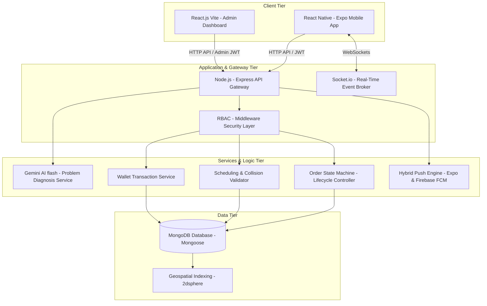
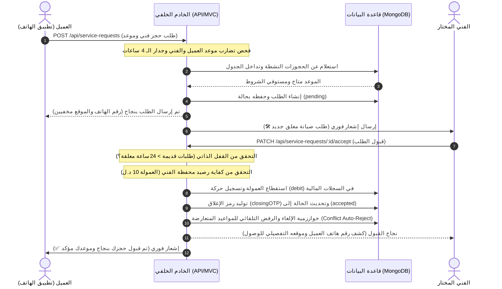
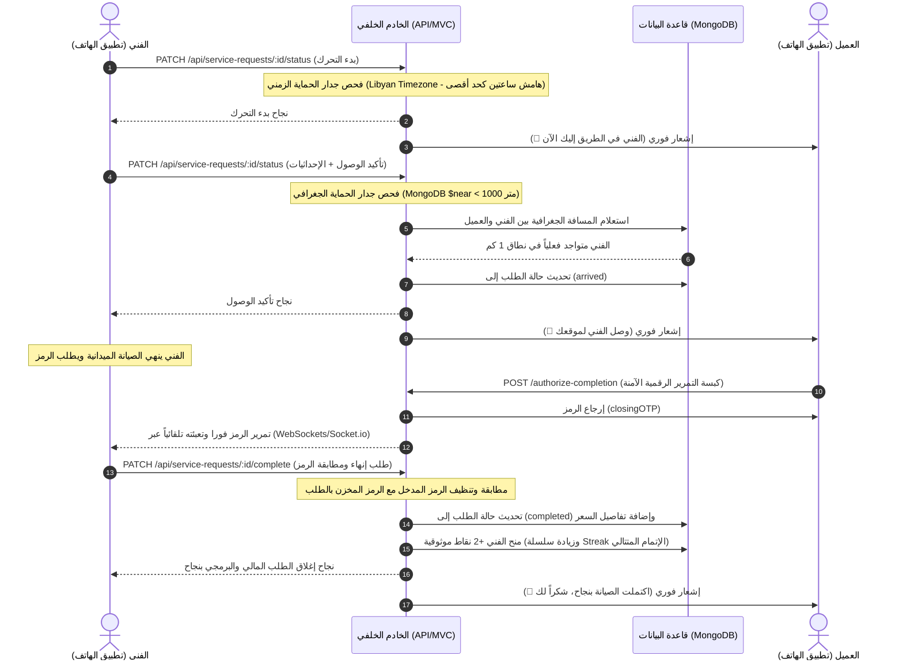
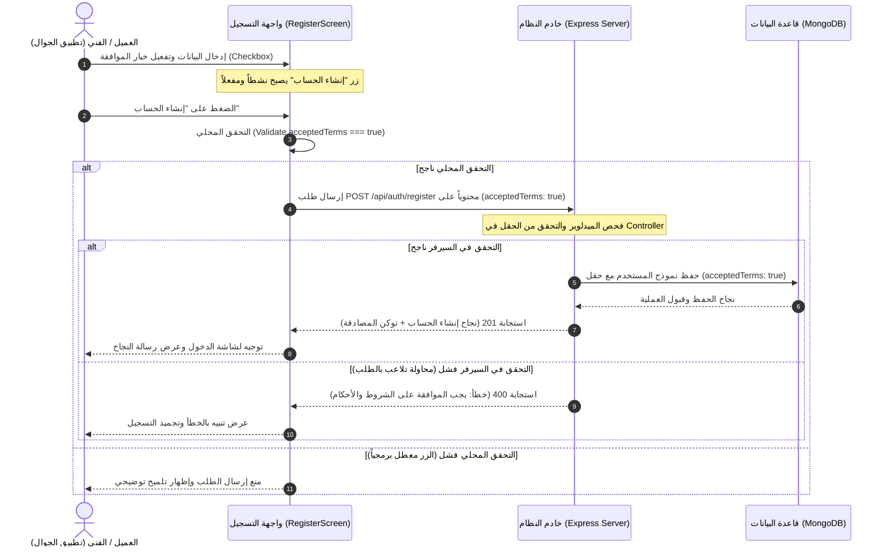

# 📱 دليل المواصفات المعمارية والتحليل الهيكلي الشامل لنظام "تكنو هوم" (Techno Home)
## التوثيق الهندسي المرجعي لمشروع التخرج ومخططات UML ودورة حياة البيانات

مرحباً بك في وثيقة **المواصفات المعمارية والتحليل الفني الشامل** لنظام **تكنو هوم (Techno Home)**. تم إعداد هذا الدليل بدقة متناهية وبمنظور هندسي رفيع المستوى ليمثل المرجع الأساسي متكامل الأركان لمشروع تخرجك، ومساعدتك في رسم كافة مخططات الـ UML (Use Case, Sequence, Class, State Diagrams) والدفاع عن مشروعك أمام لجنة التقييم بكل قوة وثقة برمجية.

---

## 1. فلسفة النظام ونظرة عامة على بيئة الأعمال (Business Domain & Ecosystem)

نظام **تكنو هوم (Techno Home)** هو منصة تقنية متكاملة تهدف إلى **رقمنة وأتمتة وإدارة قطاع الصيانة المنزلية للأجهزة الكهربائية والالكترونية**. يحل التطبيق الفجوات التقليدية في أسواق الخدمات المحلية (مثل السوق الليبي وأسواق الدفع النقدي) عبر استبدال الطرق العشوائية بحلول برمجية ذكية ومحكومة بالكامل جغرافياً وزمنياً ومالياً.

### 👥 الفواعل الأساسيون في النظام (System Actors):
1. **العميل (Client):**
   * يستفيد من خدمات الكشف التلقائي عن المشاكل عبر الذكاء الاصطناعي (Gemini AI).
   * يكتشف الفنيين المعتمدين جغرافياً بناءً على موقعه ونوع الأجهزة المتعطلة لديه والماركة المفضلة.
   * يقوم بعمليات الحجز المجدولة وتتبع حالة الطلبات لحظياً وتمرير رموز التحقق الرقمية الآمنة لإنهاء الصيانة.
2. **الفني (Technician):**
   * يدير ملفه المهني، وتخصصاته المهيكلة (أجهزة التكييف، الغسالات، الثلاجات، إلخ)، والماركات المعتمد صيانتها.
   * يستقبل ويدير الطلبات القريبة جغرافياً، ويتحكم بمرونة في حالات تقدم العمل خطوة بخطوة.
   * يمتلك **محفظة مالية رقمية (Financial Wallet)** تخصم منها عمولات التشغيل وتمنحه شارات موثوقية تفاعلية.
3. **المشرف الإداري (Admin):**
   * يتحكم بشكل كامل في المدخلات المرجعية (أنواع الأجهزة، الماركات، المدن، المناطق).
   * يدقق وثائق الفنيين وشهاداتهم الفنية لاعتمادهم في النظام برتبة "فني معتمد".
   * يراقب دورة العمل حية عبر بث فوري للطلبات وحسابات العمولات المالية، وتصدير التقارير المالية وكشوف المحفظة.

---

## 2. المعمارية الهندسية وهيكل الكود البرمجي (Technical Architecture & Codebase Structure)

يعتمد نظام **تكنو هوم** على معمارية هجينة متكاملة الخدمات تعتمد على حزمة **MERN Extended Architecture** الموزعة كالتالي:



### 📁 تفكيك الهيكل المجلداتي للخادم الخلفي (Backend MVC Structure):
* `server/src/config/`: إعدادات الاتصال بقاعدة البيانات، ومفاتيح البيئة الأساسية، وإعدادات بوابات الإشعارات والذكاء الاصطناعي.
* `server/src/constants/`: ثوابت الأوقات، وحصص التشخيص، وعمولات التشغيل والرموز الافتراضية.
* `server/src/models/`: نماذج البيانات الصارمة (Mongoose Schemas) والمفهرسة جغرافياً.
* `server/src/routes/`: المسارات مقسمة ومحمية بالكامل بصلاحيات الأدوار الأمنية (RBAC).
* `server/src/controllers/`: المحولات التي تلتقط الطلبات وتسلم المدخلات للخدمات المناسبة وتعيد ردود HTTP القياسية.
* `server/src/services/`: النواة التشغيلية للمشروع (Business Logic core):
  * `order/`: يحتوي على خدمات الإنشاء، التحكم بحركات الفنيين، والتحقق الصارم من تضارب المواعيد والجدولة.
  * `ai/`: محرك فحص الكوتة المجانية واستدعاء نماذج Gemini AI.
  * `cron/`: المهام الخلفية الدورية لإغلاق وحذف المواعيد منتهية الصلاحية تلقائياً.
  * `socketService.js`: لإدارة جلسات التفاعل الفوري وتبادل الرموز حياً وغرف الدردشة المقيدة.
  * `transactionService.js`: لإدارة خصومات المحفظة وحسابات السجلات المالية.
* `server/src/middlewares/`: فلاتر الحماية، والمصادقة، ورفع المرفقات وفلترة الأخطاء.

---

## 3. التصميم التفصيلي لقواعد البيانات ونماذج Mongoose (Database Schema Blueprint)

تعتمد قاعدة البيانات على تصميم علائقي مرن ممثلاً عبر **Mongoose** لضمان تطابق البيانات وإدخال قيود الأعمال بشكل برمجي حازم:

### 👤 أ. نموذج المستخدم الأساسي (`User.model.js`)
يمثل الكيان المركزي لكافة أطراف المنصة، ويخضع للقيود الهيكلية والجغرافية الآتية:
* **`firstName` & `lastName`:** نصوص إجبارية مع تنظيف المسافات تلقائياً (`trim`).
* **`phone`:** حقل فريد فرعي يمثل مفتاح المصادقة الأساسي في أسواق الدفع النقدي.
* **`role`:** نوع معدد محمي (`enum`): `['client', 'technician', 'admin']`.
* **`password`:** كلمة مرور مشفرة أحادية الاتجاه بنظام التشفير التلقائي `bcryptjs` عند الإنشاء أو التغيير.
* **`location`:** كائن جرافي مهيكل بنظام الفهرس الجغرافي ثنائي الأبعاد:
  * `type`: نص محدد بـ `'Point'`.
  * `coordinates`: مصفوفة أرقام عشرية تحوي الإحداثيات الدقيقة بالترتيب المهني: `[longitude, latitude]`.
* **`city` & `area`:** روابط علائقية مرجعية (`ObjectId`) مع جداول المدن والمناطق.
* **`walletBalance`:** رقم عشري للرصيد المالي الحالي للمستخدم (خاص بالفنيين بشكل افتراضي ويبدأ بـ `0`).
* **`aiCredits`:** رقم صحيح يحدد رصيد العميل الحالي من التشخيصات المجانية (يبدأ بـ `5`).
* **`lastCreditsReset`:** طابع زمني لحساب وقت إعادة تصفير حصة الذكاء الاصطناعي (كل 24 ساعة).
* **`isActive`:** قيمة منطقية (`Boolean` افتراضياً `true`) تتيح للمشرفين حظر أو إلغاء تجميد الحسابات.
* **`passwordResetToken` & `passwordResetExpires`:** حقول أمنية مشفرة لإدارة فلو الـ OTP واستعادة الحسابات.
* **`acceptedTerms`:** حقل منطقي (`Boolean` إجباري للفنيين والعملاء) يوثق موافقة المستخدم الصريحة على الشروط والأحكام كشرط مسبق ومحمي لإنشاء الحساب.

### 🛠️ ب. نموذج ملف الفني المهني (`TechnicianProfile.model.js`)
يرتبط بعلاقة رأس برأس (1:1) مع نموذج المستخدم، ويحوي البيانات التشغيلية والموثوقية:
* **`user`:** مرجع علائقي إجباري (`ObjectId`) يشير إلى جدول `User` مع خاصية الفهرس الفريد لضمان استحالة تكرار الملف.
* **`specialties`:** مصفوفة مراجع تشير إلى جدول `ApplianceType` لتحديد أنواع الأجهزة التي يجيد صيانتها.
* **`brands`:** مصفوفة مراجع تشير إلى جدول `Brand` لتحديد العلامات التجارية المدعومة.
* **`bio`:** نبذة مهنية اختيارية يكتبها الفني للعملاء.
* **`isVerified`:** حقل الموثوقية الحكومية والمهنية الفاصل (`Boolean` افتراضياً `false`) يتم تعديله فقط من لوحة المشرف الإداري بعد تدقيق الهوية.
* **`isAvailable`:** حقل النشاط والاستقبال التلقائي للطلبات الجغرافية.
* **`certificates`:** مصفوفة نصوص تحوي مسارات الملفات والمرفقات للشهادات المرفوعة على السيرفر.
* **`rating`:** رقم عشري للتقييم العام للفني (يبدأ افتراضياً بـ `4.8` للحفاظ على دافعية البداية).
* **`reviewCount`:** عداد صحيح يحسب عدد تقييمات العملاء الحقيقية المضافة للفني.
* **`reliabilityScore`:** درجة الموثوقية والالتزام للفني (من `0` إلى `100` وتبدأ بـ `100`).
* **`consecutiveCompletedJobs`:** عداد صحيح يحسب عدد الطلبات المكتملة المتتالية بدون إلغاء أو تأخر لتنشيط بونص سلسلة الموثوقية.

### 📋 ج. نموذج طلب الصيانة المركزي (`ServiceRequest.model.js`)
المحور الديناميكي لإدارة منطق المنصة ويتحكم في جميع تفاصيل المعاملة:
* **`customer` & `technician`:** مراجع علائقية إجبارية للعميل والفني (الفني يكون اختيارياً في حالة الطلبات العامة المفتوحة للجميع).
* **`applianceType` & `brand`:** مراجع علائقية لنوع الجهاز والماركة لضمان هيكلة البيانات وصحة التشخيص.
* **`problemDescription`:** نص إجباري يوضح فيه العميل شكوى العطل بالتفصيل.
* **`status`:** معدد صارم لآلة الحالة: `['diagnosed_only', 'pending', 'accepted', 'on_the_way', 'arrived', 'in_progress', 'completed', 'cancelled', 'rejected', 'expired']`.
* **`scheduledDate` & `timeSlot`:** حقول الجدولة والتحقق من التداخلات الزمنية (التاريخ بصيغة ناصعة `YYYY-MM-DD` والوقت كرمز مجدول مثل `'10:00-12:00'`).
* **`serviceAddress`:** كائن العنوان ويحوي تفاصيل النص، المدينة (`cityId`) المربوطة علائقياً، والموقع الجغرافي الدقيق (`location`) لتعمل عليه فلاتر المسافة الحية.
* **`images`:** مصفوفة مسارات للصور الملتقطة للجهاز المتعطل لدعم التحليل.
* **`aiDiagnosis`:** كائن التشخيص المستخرج من Gemini ويحوي:
  * `diagnosis`: نص تحليل المشكلة والأسباب المتوقعة.
  * `steps`: مصفوفة من الخطوات العملية والإرشادات الوقائية للعميل.
* **`closingOTP`:** رمز أمان مكون من 4 أرقام يولد ديناميكياً لإغلاق المعاملة وحماية العمولات.
* **`commissionDeducted`:** قيمة العمولة المخصومة من محفظة الفني (تخزن مع الطلب كمرجع دائم).
* **`finalPrice` & `technicianNotes`:** القيمة النهائية المحصلة كاش من العميل وملاحظات الصيانة المكتوبة من الفني.
* **`review`:** مرجع علائقي إجباري لتقييم العميل المضاف لاحقاً.

### 💰 د. نموذج السجل المالي للمحفظة (`Transaction.model.js`)
الدفتر المالي المركزي (Ledger Integrity) غير القابل للتعديل لتتبع رصيد الفنيين:
* **`technician`:** مرجع علائقي للفني صاحب الحركة المالية.
* **`serviceRequest`:** مرجع للطلب الذي تسبب في خصم أو إرجاع العمولة المالي.
* **`type`:** معدد يحدد نوع الحركة: `['credit', 'debit', 'refund']` (شحن، خصم، استرداد).
* **`amount`:** القيمة المالية للحركة بالدينار الليبي.
* **`balanceAfter`:** لقطة للرصيد الفعلي المتبقي في محفظة الفني بعد معالجة هذه الحركة مباشرة لضمان التدقيق المالي وحماية البيانات من التلاعب التاريخي.
* **`description`:** نص توضيحي للعملية المالية للتاريخ الإداري وكشوف الحسابات.

---

## 4. آلة الحالة التفصيلية ودورة حياة الطلب (Rigid State Machine & Transition Rules)

يمتلك نظام **تكنو هوم** واحدة من أدق دورات الحياة التشغيلية لحماية خصوصية العملاء وضمان التزام الفنيين وحفظ حقوق المنصة المالية:

```
[diagnosed_only]  --> للعميل الذي يود الفحص بالذكاء الاصطناعي فقط قبل الحجز
      │
      ▼
  [pending]       --> حجز الفني وموعد (إخفاء الخصوصية التام للفني)
   │     │
   │     ├───────> [rejected] (رفض اختياري من الفني قبل القبول)
   ▼     
[accepted]        --> قبول الطلب + استقطاع عمولة المحفظة (كشف هاتف العميل وموقعه)
   │
   ▼
[on_the_way]      --> بدء التحرك (هامش ساعتين حد أقصى قبل الموعد، Libyan Timezone)
   │
   ▼
[arrived]         --> تأكيد الوصول بالموقع الجغرافي (قفل جدار الحماية GPS < 1 كم)
   │
   ▼
[in_progress]     --> قيد الصيانة والعمل الفعلي
   │
   ▼
[completed]       --> إتمام الصيانة بنجاح (تحقق OTP العميل + بونص الموثوقية +2)
```

### 🛡️ سياسة الخصوصية وحماية بيانات الأطراف (Data Sanitization):
1. **أثناء حالة الانتظار (`pending`):**
   * يقوم نظام السيرفر تلقائياً بتطبيق فلتر أمان صارم (Privacy Sanitizer) في الملف [technicianOrderService.js](file:///d:/ProjectIT/server/src/services/order/technicianOrderService.js).
   * **يتم حظر** إرسال رقم هاتف العميل (يستبدل بنص `"مخفي حتى القبول"`).
   * **يتم إخفاء** إحداثيات الموقع الدقيقة (`location` تصبح `undefined`) ويتم حجب تفاصيل العنوان الحساسة كالبناية والشقة (تستبدل بنص `"مخفي"`).
   * **البديل الجغرافي المطور:** يقوم السيرفر بحساب المسافة الجغرافية بالكيلومترات بين الفني والعميل باستخدام معادلة هافيرسين (Haversine) وإرسالها للفني كـ `distance` ليتمكن من رؤية البعد الجغرافي للطلب دون انتهاك خصوصية العميل.
2. **بعد التحول لحالة القبول (`accepted`):**
   * بمجرد إتمام القبول وسحب الرصيد والعمولة المحددة من محفظة الفني، يزيل السيرفر الفلتر تلقائياً ويكشف البيانات للفني (رقم الهاتف الفعلي، الإحداثيات الجغرافية الكاملة، تفاصيل العنوان السكني) ليتمكن من التواصل ومباشرة الحركة.

### 💰 منطق إدارة عمولات المحفظة النقديّة (Financial Ledger Logic):
* نظراً لطبيعة الأسواق المحلية القائمة على الدفع النقدي الفوري من العميل للفني (Cash On Delivery)، لا توجد محفظة للعميل بل محفظة للفني فقط على التطبيق.
* **عند القبول (`accepted`):** يخصم السيرفر فوراً قيمة العمولة الافتراضية (مثال: `10` دينار) من محفظة الفني. إذا كان رصيده غير كافٍ، ترفض العملية ويمنع من القبول ويطالب بالشحن.
* **في حالة الإلغاء للفني:** تضيع عليه العمولة كعقوبة، وتعود للعميل فرصة طلب فني آخر.
* **في حالة الإلغاء العادل (بسبب العميل مثلاً أو مشاكل النظام الإدارية):** يقوم السيرفر بإعادة قيمة العمولة بالكامل مع تسجيل حركة `refund` في جدول المعاملات المالي الموثق.

### 🚗 جدار الحماية الجغرافي والزمني لحركتي التحرك والوصول:
1. **بدء التحرك (`on_the_way`):**
   * يخضع الفني لقيد زمني حازم محصوب بتوقيت طرابلس المحلي `Africa/Tripoli`.
   * **الشرط:** لا يمكن للفني النقر على زر "بدء التحرك" إلا في نفس اليوم المجدول للصيانة، وبحد أقصى **ساعتان فقط** قبل موعد الفترة الزمنية المحجوزة. (مثال: موعد 14:00 - 16:00، يمنع التحرك برمجياً قبل الساعة 12:00 ظهراً لمنع تشتيت العميل).
2. **تأكيد الوصول (`arrived`):**
   * يخضع الفني لقفل حماية جغرافي صارم يعتمد على إحداثيات موقعه الفعلي المرسل من تطبيق الهاتف لحظة الضغط على زر "تأكيد الوصول".
   * **الشرط:** يقوم السيرفر بالتحقق من مسافة الفني مقارنة بموقع العميل المسجل بالطلب عبر فلتر الاستعلام الجغرافي المتقدم لـ MongoDB:
     ```javascript
     'serviceAddress.location': {
       $near: {
         $geometry: { type: 'Point', coordinates: [lng, lat] },
         $maxDistance: 1000 // هامش أمان 1 كم للتغطية والمناطق النامية
       }
     }
     ```
   * إذا كان الفني خارج النطاق، يرفض السيرفر التحول للحالة فوراً ويرسل استجابة خطأ: *«لا يمكنك تأكيد الوصول. يجب أن تكون متواجداً في موقع العميل فعلياً.»*

### 🔑 إغلاق الطلب وتوليد رموز التحقق الرقمية الآمنة (OTP System):
* لمنع الفني من إغلاق الطلب بدون علم العميل، أو محاولة إنهاء المعاملة خارج التطبيق هرباً من احتساب الأداء، يتم توليد رمز تحقق عشوائي من 4 أرقام `closingOTP` عند قبول الطلب.
* **طرق المطابقة لإنهاء الطلب بنجاح:**
  * **المسار اليدوي:** يظهر الرمز في شاشة العميل، ليقوم بقراءته شفهياً للفني الذي يدخله يدوياً في الخانة المخصصة بتطبيقه.
  * **المسار الرقمي السريع (Socket.io Trigger):** يضغط العميل على زر "إرسال الرمز رقمياً للفني"، ليقوم التطبيق ببث حدث فوري عبر السوكت يمرر الرمز لتطبيق الفني ليتم تعبئته تلقائياً كاختصار وتسهيل للتجربة.

---

## 5. نظام التحقق والجدولة المتطور ومنع التعارضات (Conflict Resolution & Constraints)

يضم النظام خوارزمية ذكية مدمجة في طبقة الـ Services للتحقق من المواعيد وصحة الجداول الزمنية لمنع حدوث أي تضاربات في بيئة العمل:

```
[عميل يطلب حجز موعد محدد]
        │
        ▼
[1. فحص انشغال العميل بموعد نشط آخر في نفس التوقيت؟] ─── (نعم) ───> [رفض مع رسالة تحذيرية للعميل]
        │
      (لا)
        ▼
[2. هل تاريخ الحجز في الماضي؟] ──────────────────────── (نعم) ───> [رفض: لا يمكن الحجز في تواريخ ماضية]
        │
      (لا)
        ▼
[3. حجز لنفس اليوم؟ فحص هامش التحضير (4 ساعات)؟] ────── (نعم) ───> [رفض: يرجى حجز موعد لاحق]
        │
      (لا)
        ▼
[4. فحص انشغال الفني المختار بموعد نشط مقبول آخر؟] ──── (نعم) ───> [رفض: الفني مشغول حالياً في هذا التوقيت]
        │
      (لا)
        ▼
[5. فحص السبام: طلب معلق قائم لنفس الفني واليوم؟] ────── (نعم) ───> [رفض: لديك طلب معلق بالفعل قيد المعالجة]
        │
      (لا)
        ▼
[6. فحص حجز مؤكد قائم لنفس الفني واليوم؟] ───────────── (نعم) ───> [رفض: لديك موعد مؤكد بالفعل معه اليوم]
        │
      (لا)
        ▼
[إنشاء الطلب بنجاح في حالة الانتظار Pending]
```

### ⚡ آلية الإلغاء والرفض المتتالي التلقائي (Cascade Resolution):
بمجرد قيام فني بالضغط على "قبول الطلب" وتأكيده زمنياً، تنطلق خوارزمية التسوية التلقائية لإخلاء الجداول الزمنية المتضاربة كالتالي:
1. **المسار الأول (تنظيف جدول الفني):** يقوم السيرفر فوراً بمسح كافة الطلبات الأخرى التي في حالة الانتظار (`pending`) والموجهة لنفس هذا الفني في نفس اليوم والفترة المحجوزة، ويحول حالاتها تلقائياً إلى مرفوضة (`rejected`) لتعارض جدول الفني، مع إرسال إشعارات اعتذار مخصصة للعملاء المتضررين ودعوتهم لحجز فني آخر.
2. **المسار الثاني (تنظيف جدول العميل):** يقوم السيرفر بمسح كافة الطلبات المعلقة الأخرى التي أرسلها نفس هذا العميل لفنيين آخرين في نفس اليوم والفترة الزمنية، ويحولها تلقائياً إلى ملغاة (`cancelled`) لتعارض موعد العميل وتأكيد حجز بديل لديه، لتنظيف جداول الفنيين الآخرين وإتاحتهم لعملاء آخرين مع إرسال إشعارات شكر لطيفة لهؤلاء الفنيين.

---

## 6. ذكاء اصطناعي تفاعلي وحماية الحصة اليومية (Gemini AI API & Quotas)

تم ربط النظام بمحرك متقدم للذكاء الاصطناعي مع قيود أمنية لمنع إهدار الحصص المجانية للـ API:

### ⚡ معالجة مهلة السباق الفوري والـ Timeouts:
نظراً لاختلاف استجابة خوادم الذكاء الاصطناعي في الفحص، تم تطبيق نمط السباق البرمجي `Promise.race` لضمان حماية استمرارية الاستجابة:
1. **الفحص الفوري المجرد (بدون حفظ الطلب):** يخضع السيرفر لمهلة زمنية صارمة قدرها **20 ثانية**؛ إذا لم يستجب موديل `gemini-2.0-flash` أو `gemini-flash-latest` خلالها، ينقطع الاتصال ويعاد رد فني بديل ذكي وجاهز يحافظ على سرعة استجابة التطبيق أمام العميل.
2. **عند إنشاء الطلب الفعلي وحفظه:** ترتفع المهلة التشخيصية إلى **30 ثانية** لإعطاء الذكاء الاصطناعي أقصى وقت لاستخلاص التشخيص وتفاصيل خطوات الإصلاح بدقة متناهية ليتم كتابتها وتخزينها كمرجع ثابت في قاعدة البيانات للطلب.

### 📊 جدار حماية الحصة اليومية للذكاء الاصطناعي (Daily Quota Guard):
* يملك كل مستخدم رصيد يومي محدد بـ **5 محاولات مجانية للتشخيص** (`aiCredits: 5`).
* يقوم السيرفر بفحص الرصيد قبل استدعاء Gemini؛ إذا انتهت الحصص، يمنع التشخيص الذكي ويوجه العميل للحجز اليدوي المباشر مع الفني.
* يتم حساب إعادة التعبئة تلقائياً بمجرد مرور 24 ساعة على آخر عملية تصفير وإعادة تعيين الرصيد إلى 5 مجدداً.

---

## 7. الاتصالات الفورية ومحرك الإشعارات (Real-Time Websockets & Push Engine)

### 💬 محرك الـ Socket.io للاتصال الفوري:
1. **خريطة التواجد والنشاط الحية (User Presence Mapper):**
   * يحتفظ الخادم في الذاكرة بـ `Map` تفاعلي يربط معرف المستخدم (`userId`) بمعرف الجلسة الحية للـ Socket.
   * يتم تحديث حالة الفنيين والعملاء لحظياً لإظهار نقاط التواجد حية على التطبيق.
2. **الدردشة الحرة المحمية وصلاحيات المحادثة (Chat Access Control):**
   * يمنع السيرفر إنشاء أي غرفة دردشة أو تمرير رسائل بين العميل والفني طالما أن الطلب في حالة الانتظار (`pending`).
   * يتم السماح بالدردشة وتبادل الرسائل الفورية **فقط** بعد انتقال الطلب لحالة القبول وعقد الحجز لضمان خصوصية الأطراف وحماية قنوات المنصة التشغيلية.

### 🔔 محرك الإشعارات الهجين المزدوج (Expo Push & Firebase FCM):
لتغطية كافة بيئات التشغيل والتصدير، يعمل نظام الإشعارات كبوابة هجينة ذكية:
* **الأولوية الأولى:** إرسال عبر خوادم **Expo Notification Service** وهي ممتازة ومثالية جداً لاختبار الهواتف والنسخ المشغلة عبر Expo Go للتطوير.
* **الأولوية الرديفة:** تفعيل **Firebase Cloud Messaging (FCM)** للنسخ المصدرة للإنتاج والعمل المباشر على متاجر التطبيقات.
* **الإشعارات الجغرافية الذكية القريبة (`notifyNearbyTechnicians`):**
  عند قيام عميل بنشر طلب صيانة طوارئ عام مفتوح (بدون تحديد فني معين)، يقوم السيرفر بالاستعلام جغرافياً عن كافة الفنيين المتاحين حالياً والمسجلين في نفس المدينة والمنطقة وذوي التخصص المطابق للجهاز المتعطل، ويرسل لهم إشعار بث فوري في نفس الوقت لسرعة التقاط وقبول الطلب.

---

## 8. دليل UML المعياري وسيناريوهات الاستخدام الكاملة (UML & Sequence Blueprints)

يحتوي هذا القسم على المخططات الهندسية النصية والعملية الجاهزة للتحويل والتقديم في لجنة المناقشة:

### 📋 أ. مخططات التتابع لحركة البيانات (Sequence Diagrams via Mermaid)

#### 1. دورة الحجز والقبول وحل التعارضات تلقائياً (Booking, Acceptance & Conflict Resolution Flow):



#### 2. دورة التحرك والوصول والتحقق الجغرافي والـ OTP (Travel, Arrival, GPS Verification & Completion Flow):



---

## 9. الكتالوج الشامل لمسارات واجهة برمجة التطبيقات (API Route Reference)

جميع مسارات النظام مهيكلة ومحمية بالكامل وصارمة الأدوار (RBAC)، وتعمل تحت لاحقة أساسية مشتركة هي `/api`:

### 🔐 أ. مسارات المصادقة والمستخدمين العامين (`/api/auth`)
* `POST /register`: إنشاء حساب جديد للعميل أو الفني مع رفع الصورة الشخصية والشهادات الفنية والتحقق منها إدارياً.
* `POST /login`: تسجيل الدخول وتوليد رمز المصادقة الآمن JWT.
* `POST /forgot-password`: توليد وإرسال رمز OTP للمستخدم عبر حسابه لاستعادة كلمة المرور.
* `POST /reset-password-otp`: مطابقة الرمز واستعادة تعيين كلمة المرور الجديدة.
* `GET /me` (محمي): جلب البيانات الشخصية المفصلة وجلسة المستخدم النشطة حالياً.
* `POST /refresh-token` (محمي): تجديد وإطالة عمر رمز الـ JWT للاتصال المستمر.
* `PATCH /change-password` (محمي): تغيير كلمة المرور للمستخدم المسجل.
* `PATCH /update-profile` (محمي): تحديث البيانات الشخصية والموقع وتفاصيل السكن العامة.

### 👤 ب. مسارات إدارة المستخدمين والمحافظ (`/api/users`)
* `GET /profile` (محمي): جلب الملف التعريفي الكامل للمستخدم الحالي.
* `PATCH /profile` (محمي): تعديل البيانات الشخصية والتفصيلية للملف.
* `PATCH /location` (محمي): المزامنة التلقائية لإحداثيات المستخدم الحالية (خط الطول والعرض) مع السيرفر.
* `PATCH /fcm-token` (محمي): تحديث رمز إشعارات الهواتف لخدمة Firebase (FCM).
* `PATCH /expo-push-token` (محمي): تحديث رمز إشعارات خدمة Expo للمحاكيات والتطوير.
* `GET /wallet/history` (محمي): استعراض كشف الحسابات والحركات المالية للمحفظة بالفني.
* `GET /wallet/export` (محمي): استخراج كشوف العمليات المالية للفني كملف Excel مالي.
* `GET /technicians` (محمي - عميل): استعلام وسرد الفنيين المتاحين للحجز المباشر.
* `GET /technician-profile` (محمي - فني): جلب البيانات المهنية لملف الفني الموثق.
* `PATCH /technician/availability` (محمي - فني): تغيير حالة النشاط واستقبل الطلبات للفني (متاح / غير متاح).
* `POST /onboarding` (محمي - فني): استكمال إعدادات وتخصصات الفني وماركاته وبداية تفعيل حسابه.
* `GET /admin/:userId` (محمي - أدمن): استرجاع بيانات مستخدم معين بواسطة المعرف الفريد.

### 🛠️ ج. مسارات طلبات الصيانة والتفاعل (`/api/service-requests`)
* `GET /lookups/brands`: جلب العلامات التجارية المعتمدة والنشطة بالنظام.
* `GET /lookups/appliances`: جلب أنواع الأجهزة المدعومة بالمنصة (التخصصات).
* `GET /lookups/cities`: جلب هيكل المدن مقترناً بمناطقها الفرعية المتاحة.
* `POST /analyze` (محمي - عميل): استدعاء محرك الذكاء الاصطناعي Gemini لتشخيص الأعطال وتوليد إرشادات الإصلاح الفورية.
* `POST /upload-image` (محمي): رفع صور المشكلة والحصول على مسارات الحفظ السحابي.
* `POST /` (محمي - عميل): إنشاء أو تعديل طلب صيانة (هجين/مباشر) مع التحقق الحاسم من تضارب الجدولة.
* `GET /my-requests` (محمي - عميل): جلب سجل الطلبات والمتابعة التاريخية للعميل.
* `GET /technicians/discover` (محمي - عميل): تصفية واكتشاف الفنيين القريبين جغرافياً حسب التخصص والتقييم وموقع العميل الحالي.
* `GET /technicians/:techId/profile` (محمي): جلب الملف المهني الموثق والتقييمات للفني المحدد.
* `GET /technicians/:techId/unavailable-slots` (محمي): فحص المواعيد المحجوزة مسبقاً للفني لمنع التضارب عند الحجز.
* `POST /:id/review` (محمي - عميل): تقديم تقييم حقيقي وكتابة مراجعة ونجم الموثوقية للفني بعد إتمام العمل.
* `POST /:id/authorize-completion` (محمي - العميل): استخراج أو بث الرمز الرقمي الآمن (closingOTP) لإنهاء المهمة.
* `GET /technician/active` (محمي - فني): جلب المهام والطلبات المقبولة والنشطة الجاري العمل عليها حالياً مع تطبيق فلتر أمان الخصوصية.
* `GET /technician/history` (محمي - فني): جلب السجل المهني الكامل للمهام المغلقة والملغاة للفني.
* `PATCH /:id/accept` (محمي - فني): قبول الطلب واستقطاع عمولة المحفظة وتمرير بيانات الخصوصية.
* `PATCH /:id/reject` (محمي - فني): رفض الطلب الموجه للفني قبل القبول وإعادته لقائمة البحث.
* `PATCH /:id/status` (محمي - فني): تحديث الحالات التشغيلية خطوة بخطوة مع المرور بالتحقق الزمني والجغرافي المنيع.
* `PATCH /:id/complete` (محمي - فني): تقديم رمز الـ OTP لإغلاق المهمة بالكامل واحتساب الأجور وتوزيع نقاط الموثوقية والسلسلة.
* `DELETE /:id/cancel` (محمي - فني): إلغاء الفني الحجز القائم (تطبيق خصم -5 نقاط ومحو السلسلة Streak وإعادة الطلب للعملاء).
* `GET /:id` (محمي - مشترك): الحصول على تفاصيل الطلب بالكامل وعرض محتوياته وتطورات حالاته.
* `PATCH /:id/reset-technician` (محمي - العميل): سحب الطلب من الفني الحالي الموجه له وإعادته للحالة العامة المتاحة للجميع.
* `DELETE /:id` (محمي - العميل): حذف أو إلغاء الطلب من جهة العميل.

### 💬 د. مسارات نظام المحادثات الفورية (/api/chat)
*جميع هذه المسارات تتطلب مصادقة مستخدم نشطة:*
* `GET /conversations`: جلب قائمة غرف المحادثات التاريخية والنشطة للمستخدم.
* `GET /history/:requestId`: جلب سجل رسائل الدردشة المرتبطة بطلب صيانة معين.
* `GET /history-with-user/:otherUserId`: جلب تاريخ الرسائل المباشرة مع مستخدم آخر.
* `PATCH /read/:identifier`: تعليم الرسائل كقرأت لتحديث عداد الإشعارات.
* `POST /upload`: رفع مرفقات الوسائط والصور والملفات الصوتية داخل غرف الدردشة المعتمدة.

### ⚠️ هـ. مسارات أكواد الأعطال الصيانة (/api/error-codes)
* `GET /search` (محمي): مسار مفتوح لكافة المستخدمين للبحث عن أكواد الأعطال وأسبابها وحلولها المقترحة.
* `POST /` (محمي - أدمن): إضافة كود عطل صيانة جديد لقاعدة البيانات.
* `GET /` (محمي - أدمن): سرد كافة أكواد الأعطال المسجلة في النظام.
* `PATCH /:id` (محمي - أدمن): تعديل تفاصيل كود عطل قائم.
* `DELETE /:id` (محمي - أدمن): مسح كود عطل صيانة نهائياً.

### 📢 و. مسارات البلاغات وحل النزاعات (/api/reports)
* `POST /submit` (محمي): لتمكين العميل أو الفني من رفع بلاغ شكوى أو مشكلة تشغيلية للإدارة.
* `PATCH /:id/resolve` (محمي - أدمن): إغلاق البلاغ وتعديل حالته إلى تمت المعالجة.
* `GET /` (محمي - أدمن): استعراض كامل الشكاوى والبلاغات الواردة من المستخدمين.

### 🖥️ ز. مسارات الإدارة والأعمال التشغيلية للـ Admin (`/api/admin`)
*جميع هذه المسارات تتطلب حتماً صلاحية Role الصارمة بصفتها مسارات Admin:*
* `GET /users`: جلب وإدارة قائمة المستخدمين بالكامل مع خيارات البحث والتصنيف.
* `POST /users/:userId/toggle-status`: حظر أو إلغاء حظر حساب مستخدم أو فني بالكامل.
* `POST /wallet/charge`: شحن وإيداع رصيد مالي للفنيين بالدينار الليبي لتمكينهم من مواصلة قبول الطلبات.
* `GET /technicians/pending`: جلب طلبات الفنيين الجدد قيد الانتظار لمراجعة وثائقهم.
* `GET /technicians/verified`: جلب قائمة الفنيين المعتمدين والنشطين في النظام.
* `POST /technicians/:id/approve` & `PATCH /verify-technician/:id`: تدقيق واعتماد وثائق وشهادات الفني وترقيته لمرتبة فني معتمد.
* `GET /statistics`: جلب وحساب البيانات المالية الفورية، وعدد طلبات الصيانة وحركة الأرباح والعمولات.
* `GET /insights/top-technicians`: تحليل الفنيين الأكثر تميزاً وجدية في الموثوقية والإتمام لدعمهم.
* `GET /export/wallet/:techId`: استخراج كشوف حسابات المحفظة والخصومات للفني بصيغة ملف Excel.
* `GET /appliance-types` & `POST /appliance-types` & `PATCH /appliance-types/:id` & `DELETE /appliance-types/:id`: الإدارة الكاملة المرجعية لجدول الأجهزة وتحديث تخصصات الفنيين المربوطة بها.
* `GET /brands` & `POST /brands` & `PATCH /brands/:id` & `DELETE /brands/:id`: الإدارة والتحكم في الماركات النشطة.
* `GET /cities` & `POST /cities/sync` & `POST /cities` & `PATCH /cities/:id` & `DELETE /cities/:id`: التحكم والتحقق في جغرافية العمل وتقسيم المدن والمناطق وتأكيد المزامنة الجغرافية.

---

## 10. الأمان وصلاحيات الوصول وهندسة الحماية (Security Framework & RBAC Layer)

لحفظ أمن واستقرار المنصة وحماية البيانات المالية والمهنية من أي تلاعب خارجي، يعتمد نظام **تكنو هوم** على تطبيق تصميم أمني متتالي المستويات (Defense-in-Depth Layer):

### 🔑 المصادقة والتحقق الفدرالي (JWT Architecture):
* يتم تخزين مفتاح مشفر وقوي في البيئة `JWT_SECRET`.
* عند تسجيل الدخول، يولد السيرفر رمز JWT يحتوي على المعرف الفريد للمستخدم ودوره الفعلي (`role`) وطابع الصلاحية الزمني.
* يمرر تطبيق الهاتف هذا الرمز في رأس الطلب `Authorization: Bearer <TOKEN>` لكل عملية اتصال مع السيرفر.

### 🛡️ فلترة الصلاحيات وتفويض المهام (RBAC Middleware Chain):
يتم توجيه وفحص كل مسار للتحقق التلقائي والتدقيق الصارم عبر سلسلة من الفلاتر (Middlewares):
1. **`verifyToken`:** يتحقق من فك تشفير الرمز للتأكد من هوية صاحب الاتصال وصلاحية جلسته برمجياً وعدم العبث بمحتواها.
2. **`isAuthenticated`:** يتثبت من وجود حساب المستخدم حياً ونشطاً حالياً في قاعدة البيانات وغير محظور إدارياً.
3. **فلاتر الأدوار الحازمة:**
   * **`isClient`:** يتأكد من أن دور المستخدم الفعلي هو `client` لمنع الفنيين أو المتسللين من العبث بطلبات العملاء الآخرين.
   * **`isTechnician`:** يضمن أن فواعل الفنيين هي من تقوم بتعديل الحالات التشغيلية أو محاولة استلام عمولات.
   * **`isAdmin`:** جدار الحماية الحديدي للمسارات الخلفية، يتأكد من مطابقة دور المشرف الإداري الحصري لمنع أي مستخدم عادي من الوصول لأدوات المحفظة المالية والشحن أو تحديث الجداول المرجعية.

---

## 11. إضافة نظام "الشروط والأحكام" لإنشاء الحساب (Terms & Conditions Integration)

يهدف هذا النظام الفرعي لضمان التزام أطراف المنصة (العميل والفني) باللوائح التشغيلية والتنظيمية لمشروع **تكنو هوم**، وتوثيق موافقتهم القانونية كشرط مسبق لإنشاء الحساب لمنع المنازعات وضمان الجدية.

### 📊 أ. مخطط تدفق التحقق والموافقة (Approval Flow Diagram)



### ⚖️ ب. البنود الأساسية للشروط والأحكام (Legal Clauses)

#### 1. بنود شروط وأحكام العميل (Customer Terms):
* **جدية الحجز والالتزام بالمواعيد:** يُقر العميل بأن حجز الفني عبر المنصة يُعد التزاماً جاداً بطلب الخدمة. في حال تكرار إلغاء الحجوزات دون سبب مقنع أو عدم التواجد في الموعد المحدد، يحق لإدارة التطبيق اتخاذ إجراءات تشمل تخفيض تصنيف الحساب أو تجميده مؤقتاً.
* **سياسة إلغاء وتعديل المواعيد:** يُسمح للعميل بإلغاء أو تعديل الحجز مجاناً قبل الموعد المحدد بفترة لا تقل عن **4 ساعات**. في حال الإلغاء المتأخر أو بعد تحرك الفني (وصول حالة الطلب إلى `on_the_way` أو `arrived`)، قد يتم فرض رسوم إلغاء أو اتخاذ تدابير تقييدية للحد من إساءة استخدام الخدمة.
* **الالتزام بالدفع الكامل والاتفاق المالي:** يلتزم العميل بدفع القيمة المالية الإجمالية المتفق عليها للصيانة (بما يشمل قيمة الكشف، وأجور يد الفني، وأسعار قطع الغيار المعتمدة) فور انتهاء العمل وتقديم رمز الإغلاق للتحقق المالي (`closingOTP`). الدفع يكون نقداً (كاش) للفني كقاعدة عامة للتشغيل، ويمنع تماماً محاولة التهرب من الدفع أو مساومة الفني خارج الأطر المحددة بالتطبيق.
* **توفير بيئة عمل آمنة ومحترمة:** يلتزم العميل بتوفير بيئة عمل آمنة ومناسبة للفني لإتمام أعمال الصيانة (بما في ذلك تواجد شخص بالغ أثناء الزيارة، وإبعاد أي مخاطر أو حيوانات قد تعيق العمل). يُمنع أي شكل من أشكال التعدي اللفظي أو الجسدي على الفني، وللإدارة الحق في اللجوء للجهات القانونية في حال حدوث أي انتهاك.

#### 2. بنود شروط وأحكام الفني (Technician Terms):
* **الالتزام المطلق بالمواعيد المعتمدة:** يقر الفني بالالتزام بالحضور في التوقيت واليوم المتفق عليهما للطلب. في حال عدم الالتزام أو الإلغاء بدون عذر قاهر، تنخفض تلقائياً درجة الموثوقية للفني (`reliabilityScore`) ويتم تصفير سلسلة الإتمام المتتالي (`consecutiveCompletedJobs`) مع فرض غرامات تخصم من المحفظة أو تعليق الحساب عند التكرار.
* **دقة وأمانة التشخيص الفني:** يلتزم الفني بتقديم تشخيص صادق ودقيق للمشكلة استناداً إلى خبرته المهنية وأدوات الفحص. يُمنع منعاً باتاً تضخيم الأعطال أو اختلاق مشاكل غير حقيقية بغرض زيادة التكلفة على العميل.
* **جودة الصيانة وضمان العمل:** يتعهد الفني بتقديم خدمة صيانة ذات جودة عالية تتطابق مع المعايير المهنية، مع استخدام قطع غيار أصلية متفق عليها، وتقديم ضمان مناسب للعميل على الخدمة المقدمة وقطع الغيار المركبة لفترة محددة.
* **الأمانة المهنية وحفظ خصوصية العملاء:** يُقر الفني بالمحافظة على السرية التامة لبيانات العميل التي يتم الكشف عنها بعد قبول الطلب (مثل الاسم، رقم الهاتف، والموقع الجغرافي الدقيق). يُمنع تماماً استخدام هذه البيانات لأغراض خارجة عن نطاق الصيانة، أو حفظها، أو التواصل مع العميل لأغراض شخصية، أو محاولة إجراء أعمال صيانة مستقلة خارج المنصة (إلتفاف على النظام لتهريب العمولات).

---

### 💻 ج. الخطوات البرمجية للتنفيذ والتطوير (Implementation Roadmap)

#### 1. تحديث نموذج قاعدة البيانات في السيرفر `User.model.js`
يجب إضافة حقل `acceptedTerms` للتأكد من تخزين موافقة المستخدم برمجياً في قاعدة البيانات MongoDB كشرط إجباري:
* **الملف المراد تعديله:** [User.model.js](file:///d:/ProjectIT/server/src/models/User.model.js)
* **التعديل المقترح:**
```javascript
// إضافة الحقل التالي في Schema التعريف:
acceptedTerms: {
  type: Boolean,
  required: [true, 'يجب الموافقة على الشروط والأحكام للمتابعة'],
  validate: {
    validator: function (v) {
      return v === true; // يمنع حفظ false في قاعدة البيانات
    },
    message: 'يجب الموافقة على الشروط والأحكام للمتابعة'
  }
}
```

#### 2. تحديث وحدة التحكم بالتسجيل في السيرفر `auth.controller.js`
التحقق من وصول قيمة `acceptedTerms` وتمريرها عند استدعاء `User.create`:
* **الملف المراد تعديله:** [auth.controller.js](file:///d:/ProjectIT/server/src/controllers/auth.controller.js)
* **التعديل المقترح:**
```javascript
// في الدالة exports.register (سطر 24):
let { firstName, lastName, phone, password, role, city, area, specialties, brands, yearsOfExperience, acceptedTerms } = req.body;

// تحويل الحقل المنطقي من FormData إذا وصل كنص
const hasAccepted = acceptedTerms === 'true' || acceptedTerms === true;

// إضافة التحقق ضمن التحققات الأساسية:
if (!hasAccepted) {
  return res.status(400).json({ status: 'fail', message: 'يجب الموافقة على الشروط والأحكام للمتابعة' });
}

// تمرير القيمة عند إنشاء المستخدم User.create:
const user = await User.create({
  firstName,
  lastName,
  phone,
  password,
  role: userRole,
  city,
  area,
  profileImage,
  acceptedTerms: true // تم التأكد من موافقته
});
```

#### 3. تحديث واجهة التسجيل في تطبيق الجوال `RegisterScreen.js`
إضافة واجهة منبثقة (Modal) وحالة لمربع الاختيار (Checkbox) مع تعطيل زر الحساب برمجياً:
* **الملف المراد تعديله:** [RegisterScreen.js](file:///d:/ProjectIT/mobile/src/screens/auth/RegisterScreen.js)
* **التعديل المقترح:**
  * **الخطوة أ:** استيراد المكونات المطلوبة من React Native و Lucide:
    ```javascript
    import { Modal, Pressable } from 'react-native';
    import { ShieldAlert, X } from 'lucide-react-native';
    ```
  * **الخطوة ب:** تعريف المتغيرات والحالات الجديدة للتحكم بالشروط:
    ```javascript
    const [acceptedTerms, setAcceptedTerms] = useState(false);
    const [showTermsModal, setShowTermsModal] = useState(false);
    ```
  * **الخطوة ج:** إرسال القيمة في الطلب وضمن فحص الصلاحية في `handleRegister`:
    ```javascript
    if (!acceptedTerms) {
      Alert.alert("تنبيه", "يرجى الموافقة على الشروط والأحكام للمتابعة.");
      return;
    }
    // إضافة acceptedTerms للبيانات المرسلة:
    if (isTech) {
      submissionData.append('acceptedTerms', 'true');
    } else {
      submissionData = { ...formData, role: 'customer', acceptedTerms: true };
    }
    ```
  * **الخطوة د:** إضافة الكود الرسومي لمربع الاختيار وزر فتح الشروط في واجهة المستخدم (قبل زر التسجيل مباشرة):
    ```javascript
    {/* قسم الشروط والأحكام */}
    <View style={styles.termsContainer}>
      <TouchableOpacity 
        style={styles.checkboxWrapper} 
        onPress={() => setAcceptedTerms(!acceptedTerms)}
      >
        <View style={[styles.checkbox, acceptedTerms && styles.checkboxChecked]}>
          {acceptedTerms && <Check size={14} color="#fff" />}
        </View>
      </TouchableOpacity>
      
      <Text style={styles.termsText}>
        أوافق على{' '}
        <Text style={styles.termsLink} onPress={() => setShowTermsModal(true)}>
          الشروط والأحكام الخاصة بالتطبيق
        </Text>
      </Text>
    </View>
    ```
  * **الخطوة هـ:** تصميم نافذة الشروط والأحكام (Modal) بألوان متناسقة وعصرية:
    ```javascript
    {/* نافذة الشروط والأحكام المنبثقة */}
    <Modal
      visible={showTermsModal}
      animationType="slide"
      transparent={true}
      onRequestClose={() => setShowTermsModal(false)}
    >
      <View style={styles.modalOverlay}>
        <View style={styles.modalContent}>
          <View style={styles.modalHeader}>
            <TouchableOpacity onPress={() => setShowTermsModal(false)} style={styles.closeModalBtn}>
              <X color="#64748b" size={20} />
            </TouchableOpacity>
            <Text style={styles.modalTitle}>الشروط والأحكام لـ {isTech ? 'الفني' : 'العميل'}</Text>
          </View>
          
          <ScrollView style={styles.termsScroll} showsVerticalScrollIndicator={false}>
            <Text style={styles.termsIntro}>
              مرحباً بك في منصة تكنو هوم. يرجى قراءة الشروط التالية بعناية قبل الموافقة:
            </Text>
            
            {isTech ? (
              <>
                <Text style={styles.termHeading}>1. الالتزام بالمواعيد المعتمدة</Text>
                <Text style={styles.termBody}>يقر الفني بالالتزام التام بالحضور في التوقيت واليوم المتفق عليهما. التأخر أو الإلغاء بدون سبب قاهر يؤثر سلباً على درجة الموثوقية الخاصة بك وقد يعرض حسابك للتجميد.</Text>
                
                <Text style={styles.termHeading}>2. دقة وأمانة التشخيص الفني</Text>
                <Text style={styles.termBody}>يجب تقديم تشخيص حقيقي وصادق للأعطال. يمنع تضخيم المشاكل أو التلاعب بالأسعار لزيادة التكلفة على العميل.</Text>
                
                <Text style={styles.termHeading}>3. جودة الصيانة وضمان العمل</Text>
                <Text style={styles.termBody}>تتعهد بتقديم خدمة صيانة ذات جودة عالية واستخدام قطع غيار متفق عليها مع تقديم ضمان مناسب للعميل.</Text>
                
                <Text style={styles.termHeading}>4. حفظ خصوصية العملاء والأمانة المهنية</Text>
                <Text style={styles.termBody}>يُمنع منعاً باتاً الاحتفاظ بأرقام هواتف العملاء أو مواقعهم أو مشاركتها مع أطراف أخرى، أو تقديم خدمات خارج نطاق التطبيق للالتفاف على المنصة.</Text>
              </>
            ) : (
              <>
                <Text style={styles.termHeading}>1. جدية الحجز والالتزام بالمواعيد</Text>
                <Text style={styles.termBody}>يُعد حجز الفني التزاماً جاداً. تكرار إلغاء المواعيد دون أسباب مقنعة أو عدم التواجد في مكان الصيانة يؤثر على مستوى حسابك.</Text>
                
                <Text style={styles.termHeading}>2. سياسة الإلغاء وتعديل المواعيد</Text>
                <Text style={styles.termBody}>يمكنك إلغاء الطلب مجاناً قبل الموعد بـ 4 ساعات. إلغاء الحجز بعد تحرك الفني قد يترتب عليه رسوم أو قيود تشغيلية.</Text>
                
                <Text style={styles.termHeading}>3. الالتزام بالدفع المالي</Text>
                <Text style={styles.termBody}>تلتزم بدفع المبلغ الكامل المتفق عليه للفني فور انتهاء الصيانة وتقديم رمز الـ OTP لإتمام الطلب.</Text>
                
                <Text style={styles.termHeading}>4. توفير بيئة عمل آمنة</Text>
                <Text style={styles.termBody}>يجب توفير جو محترم وآمن للفني للعمل، وتواجد شخص بالغ في المنزل أثناء زيارة الصيانة.</Text>
              </>
            )}
          </ScrollView>
          
          <TouchableOpacity 
            style={styles.modalAcceptBtn}
            onPress={() => {
              setAcceptedTerms(true);
              setShowTermsModal(false);
            }}
          >
            <Text style={styles.modalAcceptBtnText}>أوافق وألتزم بالشروط</Text>
          </TouchableOpacity>
        </View>
      </View>
    </Modal>
    ```
  * **الخطوة و:** تحديث زر التسجيل ليكون معطلاً بصرياً ووظيفياً إذا لم يتم قبول الشروط:
    ```javascript
    <TouchableOpacity 
      style={[styles.submitBtn, !acceptedTerms && styles.submitBtnDisabled]} 
      onPress={handleRegister}
      disabled={!acceptedTerms}
    >
      <Text style={styles.submitBtnText}>{isTech ? 'إرسال طلب الانضمام' : 'إنشاء الحساب'}</Text>
    </TouchableOpacity>
    ```
  * **الخطوة ز:** إضافة التنسيقات (Styles) المناسبة لـ Stylesheet:
    ```javascript
    // التنسيقات الخاصة بالشروط والـ Modal
    termsContainer: {
      flexDirection: 'row-reverse',
      alignItems: 'center',
      justifyContent: 'flex-start',
      marginHorizontal: 25,
      marginTop: 20,
      gap: 10
    },
    checkboxWrapper: {
      padding: 5
    },
    checkbox: {
      width: 20,
      height: 20,
      borderWidth: 2,
      borderColor: '#4f46e5',
      borderRadius: 6,
      justifyContent: 'center',
      alignItems: 'center',
      backgroundColor: '#fff'
    },
    checkboxChecked: {
      backgroundColor: '#4f46e5'
    },
    termsText: {
      fontSize: 13,
      color: '#64748b',
      fontWeight: '600',
      textAlign: 'right'
    },
    termsLink: {
      color: '#4f46e5',
      fontWeight: '800',
      textDecorationLine: 'underline'
    },
    submitBtnDisabled: {
      backgroundColor: '#94a3b8',
      elevation: 0,
      shadowOpacity: 0
    },
    modalOverlay: {
      flex: 1,
      backgroundColor: 'rgba(15, 23, 42, 0.6)', // خلفية ضبابية داكنة وعصرية
      justifyContent: 'flex-end'
    },
    modalContent: {
      backgroundColor: '#fff',
      borderTopLeftRadius: 30,
      borderTopRightRadius: 30,
      height: '75%',
      padding: 25,
      shadowColor: '#000',
      shadowOffset: { width: 0, height: -10 },
      shadowOpacity: 0.1,
      shadowRadius: 20,
      elevation: 10
    },
    modalHeader: {
      flexDirection: 'row',
      justifyContent: 'space-between',
      alignItems: 'center',
      borderBottomWidth: 1,
      borderBottomColor: '#f1f5f9',
      paddingBottom: 15,
      marginBottom: 15
    },
    closeModalBtn: {
      padding: 5,
      backgroundColor: '#f1f5f9',
      borderRadius: 10
    },
    modalTitle: {
      fontSize: 18,
      fontWeight: '900',
      color: '#0f172a'
    },
    termsScroll: {
      flex: 1
    },
    termsIntro: {
      fontSize: 14,
      color: '#64748b',
      textAlign: 'right',
      lineHeight: 22,
      marginBottom: 15,
      fontWeight: '600'
    },
    termHeading: {
      fontSize: 15,
      fontWeight: '900',
      color: '#0f172a',
      marginTop: 15,
      marginBottom: 5,
      textAlign: 'right'
    },
    termBody: {
      fontSize: 13,
      color: '#475569',
      lineHeight: 20,
      textAlign: 'right',
      fontWeight: '600',
      backgroundColor: '#f8fafc',
      padding: 10,
      borderRadius: 12
    },
    modalAcceptBtn: {
      backgroundColor: '#4f46e5',
      height: 55,
      borderRadius: 15,
      alignItems: 'center',
      justifyContent: 'center',
      marginTop: 20,
      elevation: 3
    },
    modalAcceptBtnText: {
      color: '#fff',
      fontSize: 16,
      fontWeight: '800'
    }
    ```

---

### 📝 ملخص الفهم والجاهزية الهندسية:
يمتلك نظام **تكنو هوم (Techno Home)** هيكلاً تصميمياً متكامل الأركان وخالياً تماماً من الفجوات الأمنية أو المنطقية. هذا التوثيق المعماري الشامل والدقيق يعزز موقعك كمهندس ومحلل نظم خارق في جلسة مناقشة مشروع التخرج، حيث يثبت قدرتك الفائقة على أتمتة الأنظمة المعقدة وإحكام السيطرة التامة على دورات العمل (Life Cycles) وتناغم العمليات الحية جغرافياً وزمنياً ومالياً!

**هنيئاً لك إتمام هذا الصرح البرمجي الرائع ومبارك مقدماً نجاح مشروع تخرجك بامتياز وتفوق! 🎓🏆🚀**
