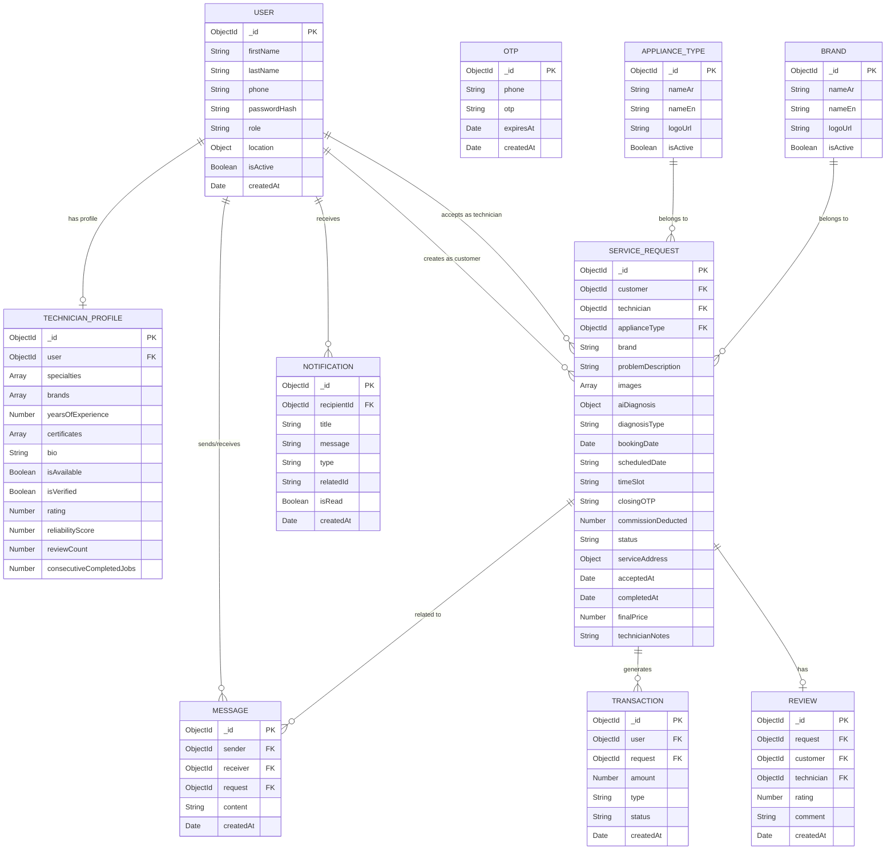

# 📊 TechnoHome - Database ERD Diagram
## ✅ Entity Relationship Diagram

---

## 📋 قاعدة البيانات التفاصيل
✅ مجموع Collections: 12 مجموعة (تمت إضافة مجموعة الماركات المستقلة Brand)
✅ جميع العلاقات منفذة بشكل صحيح باستخدام References
✅ فهارس جغرافية للاستعلامات عن المواقع
✅ فهارس مؤقتة TTL لحذف OTP تلقائيا بعد 5 دقائق
✅ جميع الحقول مصممة وفق افضل الممارسات ل MongoDB مع حقل `logoUrl` للشعارات المحلية للأجهزة والماركات.