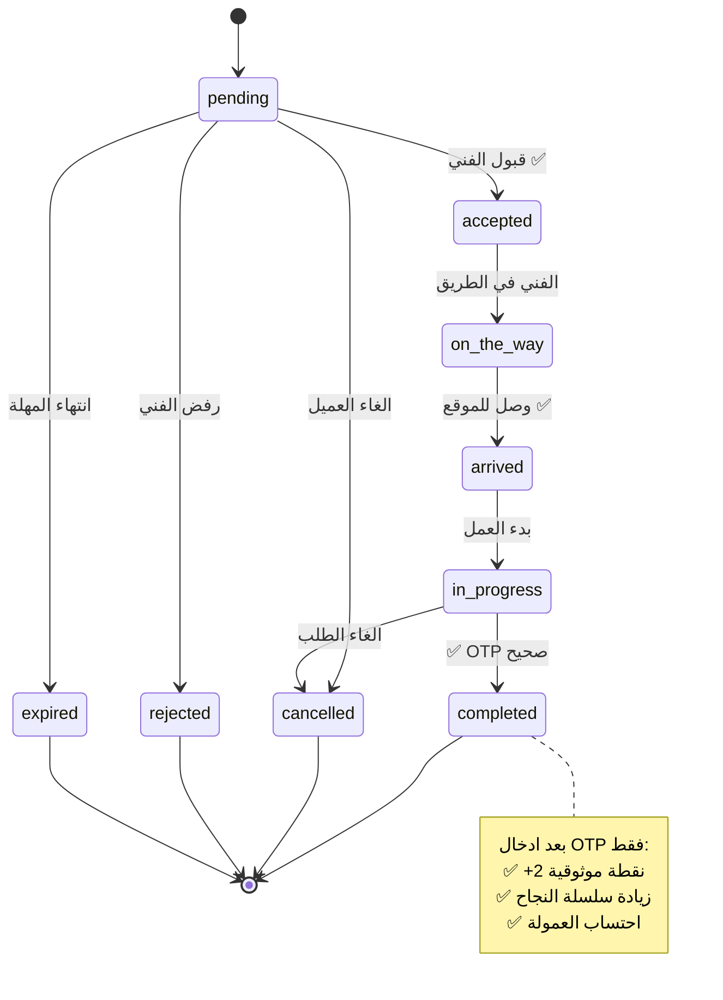
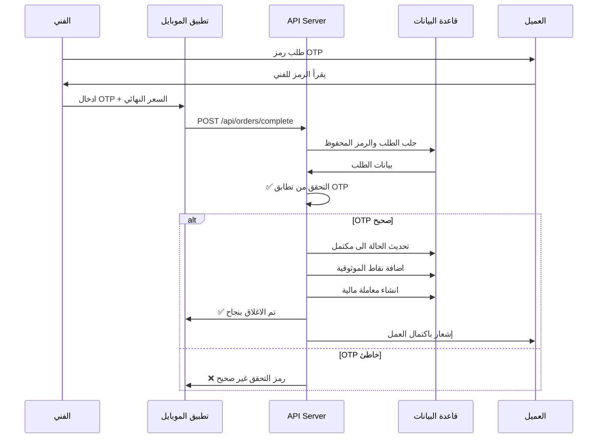

# 📐 TechnoHome - UML Diagrams
## ✅ جميع مخططات UML للنظام

---

### 🔹 1. State Machine Diagram - حالة طلب الصيانة


---

### 🔹 2. Use Case Diagram
```mermaid
usecaseDiagram
    actor العميل
    actor الفني
    actor المدير
    actor النظام

    usecase UC1: تسجيل و تسجيل الدخول
    usecase UC2: انشاء طلب صيانة
    usecase UC3: تشخيص ذكي للمشكلة
    usecase UC4: عرض الفنيين المتاحين
    usecase UC5: قبول الطلب
    usecase UC6: تحديث حالة الطلب
    usecase UC7: التحقق من OTP
    usecase UC8: اغلاق المهمة
    usecase UC9: تقييم الفني
    usecase UC10: ارسال الاشعارات
    usecase UC11: احتساب نقاط الموثوقية
    usecase UC12: ادارة النظام والفنيين

    العميل --> UC1
    العميل --> UC2
    العميل --> UC3
    العميل --> UC4
    العميل --> UC9

    الفني --> UC1
    الفني --> UC5
    الفني --> UC6
    الفني --> UC7
    الفني --> UC8

    المدير --> UC12

    النظام --> UC10
    النظام --> UC11
```

---

### 🔹 3. Sequence Diagram - عملية اغلاق المهمة بالـ OTP


---

### 🔹 4. Architecture Diagram
```mermaid
flowchart TD
    subgraph Frontend
        A[React Native Mobile App]
        B[Admin Web Dashboard]
    end

    subgraph Backend Layer
        C[Express.js API Server]
        D[Socket.io Real-time]
        E[Authentication Layer]
        F[Notification Service]
        G[OTP Service]
        H[AI Gemini Service]
    end

    subgraph Database Layer
        I[(MongoDB Database)]
    end

    A --> C
    B --> C
    C --> D
    C --> E
    C --> F
    C --> G
    C --> H
    C --> I